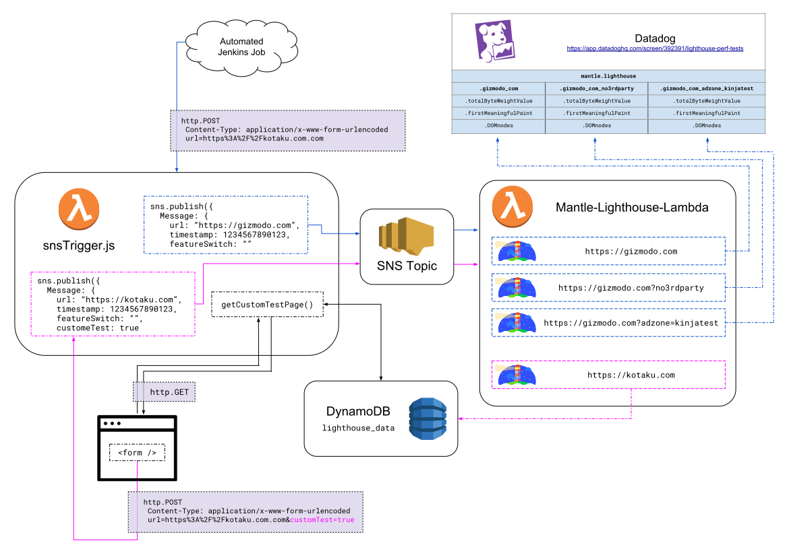

### Running [Lighthouse](https://github.com/GoogleChrome/lighthouse) performance benchmarking tests inside an AWS Lambda function.



**Run/Test Locally:**

Various build & testing tasks are available via `./tasks.sh`.

```sh
cd mantle-lighthouse-lambda

npm install
# or
yarn install --ignore-engines

./tasks.sh

#Mantle-Lighthouse-Lambda CL-Tool
#
#Please Select Task:
#   1. Test index.js - SNS Event (run a custom test of a URL)
#   2. Test index.js - SNS Event (run a custom test of a url+feature switch)
#   3. Test index.js - SNS Event (run a normal test that saves it's results to Datadog)
#   4. Test snsTrigger.js - http.POST Event (run a custom test with a base URL)
#   5. Test snsTrigger.js - http.POST Event (base URL + feature switch)
#   6. Pack Lambda for deployment - full clean & dep refresh
#   7. Pack Lambda for deployment - repackage changed files
#   0. exit
#
#Enter selection [0-7] >
```

<br/>

**Use in production & SNS**

*Verified to work using the Node.js 8.10 version runtime*

`mantle-lighthouse-lambda` has been written to respond to [SNS events](https://aws.amazon.com/sns/). The file `snsTrigger.js` has been included as a way to allow http requests to publish SNS messages in a manor that the primary Lambda (`mantle-lighthouse-lambda`) can understand and use. In production, this function will need to reside as a separate Lambda function with access to the primary Lambda and the SNS Topic that the primary Lambda is subscribed to.


*See the original [lighthouse-lambda](https://github.com/joytocode/lighthouse-lambda) repo that this was based on for more info*


**Commands in `task.sh`**

```sh
# Pack Lambda for deployment
## Repackage changed files
docker run --rm -v "$PWD":/var/task lambci/lambda:build-nodejs8.10 bash -c "rm -f mantle-lighthouse-lambda.zip && zip mantle-lighthouse-lambda.zip -r node_modules index.js package.json"
## Full clean & dep refresh
docker run --rm -v "$PWD":/var/task lambci/lambda:build-nodejs8.10 bash -c "rm -f mantle-lighthouse-lambda.zip && rm -rf node_modules && npm install && zip mantle-lighthouse-lambda.zip -r node_modules index.js package.json"


# Local Test Events

docker run --rm -v "$PWD":/var/task lambci/lambda:nodejs8.10 index.handler "$(cat ./testEvents/index_SNS-base-custom.json)"
docker run --rm -v "$PWD":/var/task lambci/lambda:nodejs8.10 index.handler "$(cat ./testEvents/index_SNS-featureSwitch.json)"
docker run --rm -v "$PWD":/var/task lambci/lambda:nodejs8.10 index.handler "$(cat ./testEvents/index_SNS-datadog.json)"
docker run --rm -v "$PWD":/var/task lambci/lambda:nodejs8.10 snsTrigger.handler "$(cat ./testEvents/snsTrigger_POST-base.json)"
docker run --rm -v "$PWD":/var/task lambci/lambda:nodejs8.10 snsTrigger.handler "$(cat ./testEvents/snsTrigger_POST-customWfeatureSwitch.json)"
```


